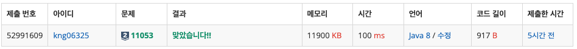

## ❔ 문제

### [문제 바로가기](https://www.acmicpc.net/problem/11053)

#### 유형 : DP

#### 티어 : Silver2

## ❕ 풀이

[동적 계획법](https://haayun.github.io/dynamic-programming/#11053-가장-긴-증가하는-부분-수열) 포스트 작성하면서 푼 문제
0번 인덱스부터 탐색하며 해당 인덱스로 끝나는 부분 수열의 최댓값을 계산하는 방식으로 풀었다.

### 👀 코드

```java
import java.io.BufferedReader;
import java.io.IOException;
import java.io.InputStreamReader;
import java.util.StringTokenizer;

public class Main_11053_가장_긴_증가하는_부분_수열 {
    public static void main(String[] args) throws IOException {
        BufferedReader br = new BufferedReader(new InputStreamReader(System.in));
        int N = Integer.parseInt(br.readLine());
        int[] A = new int[N];
        StringTokenizer st = new StringTokenizer(br.readLine());
        for (int i = 0; i < N; i++) {
            A[i] = Integer.parseInt(st.nextToken());
        }

        int[] dp = new int[N];
        int ans = 0;
        for (int i = 0; i < N; i++) {
            int prev = 0;
            for (int j = 0; j < i; j++) {
                if (A[i] > A[j])
                    prev = Math.max(prev, dp[j]);
            }
            dp[i] = prev + 1;
            ans = Math.max(ans, dp[i]);
        }
        System.out.println(ans);

    }
}

```

### 👣 결과

소요 시간 : 30 m


```toc

```
