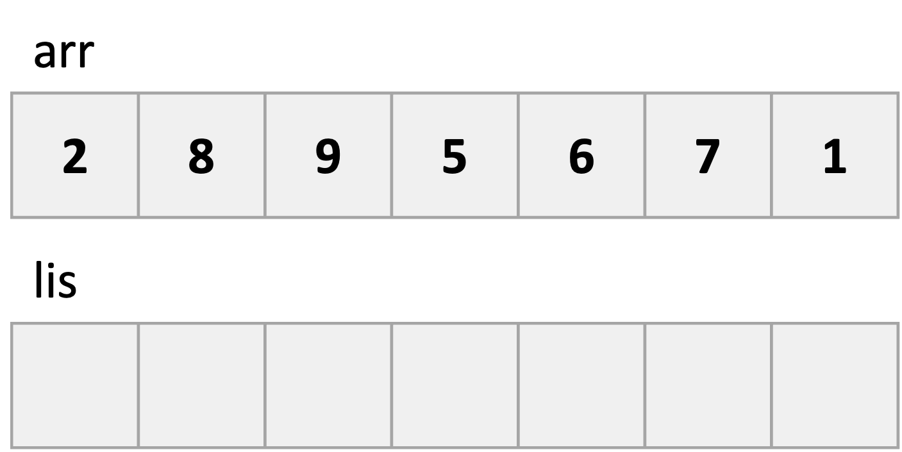
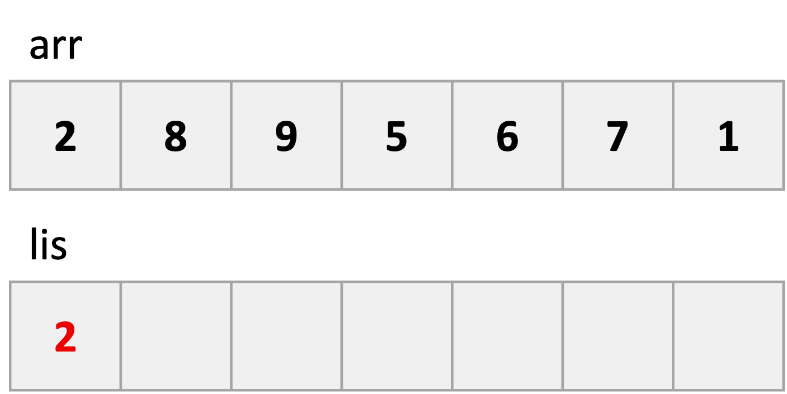
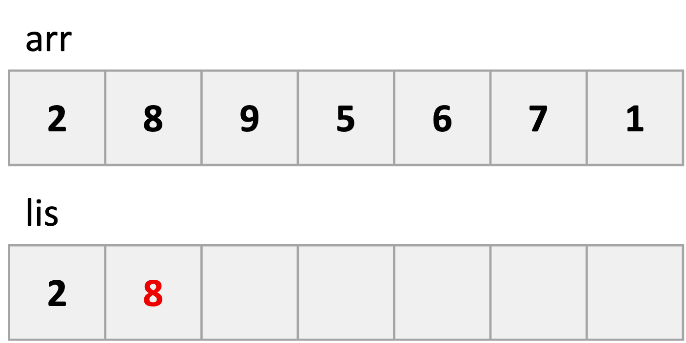
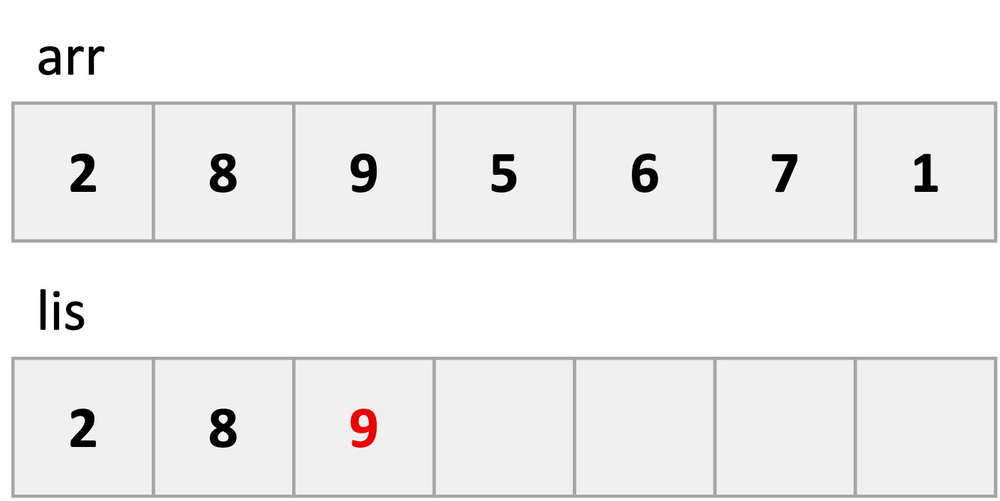
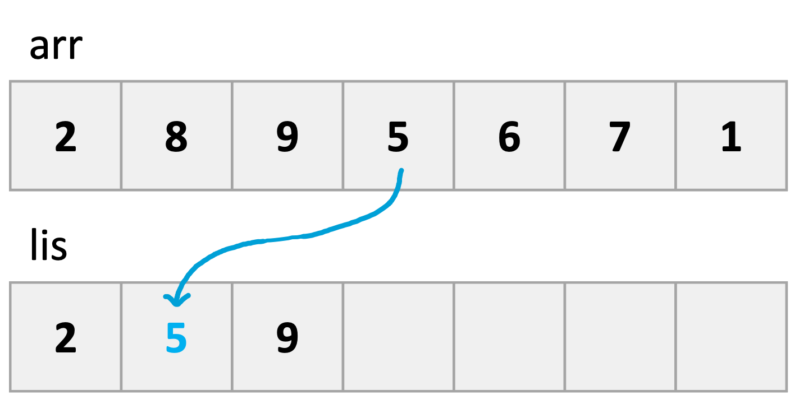
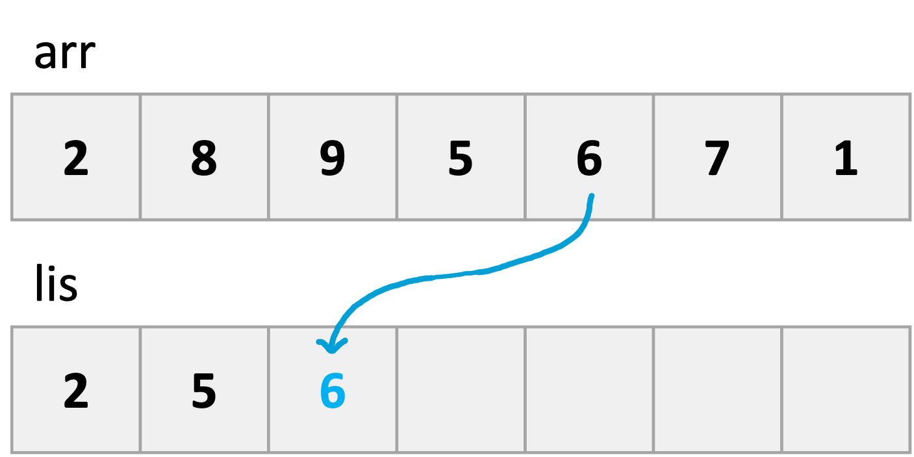
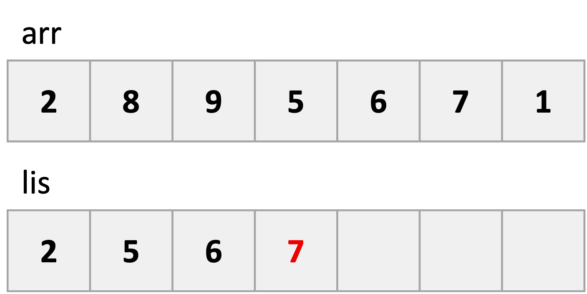
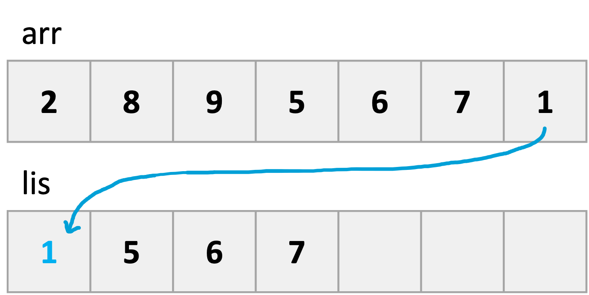
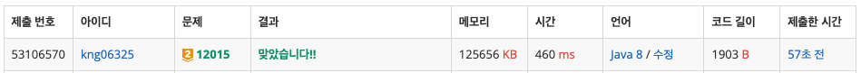

## ❔ 문제

### [12015 가장 긴 증가하는 부분 수열 2](https://www.acmicpc.net/problem/12015)

#### 유형 : LIS O(n log n), 이분탐색

#### 티어 : Gold2

## ❕ 풀이

문제에서 주어진 수열의 크기가 100만이다.
DP를 활용한 LIS는 O(n^2)이라서 불가능하다.
이분탐색을 활용해서 O(n log n)으로 해결할 수 있다고 해서 개념을 공부하면서 풀었다.

## LIS(Longest Increasing Subsequence)

### 최장 증가 부분 수열이란?

> 주어진 수열에서 **오름차순으로 정렬된 가장 긴 부분 수열**이다. 단, 부분 수열이 연속적이거나 유일할 필요는 없다.


직관적으로 LIS가 **[10, 20, 30, 50]**인 것을 알 수 있다.
LIS 문제는 knapsack, LCS와 더불어 [동적 계획법](https://haayun.github.io/dynamic-programming)을 활용하는 대표적인 유형 중 하나이다.

### 풀이 1) 동적 계획법 + 이중 for문 (O(N^2))

[동적 계획법 - 11053](https://haayun.github.io/dynamic-programming/#11053-%EA%B0%80%EC%9E%A5-%EA%B8%B4-%EC%A6%9D%EA%B0%80%ED%95%98%EB%8A%94-%EB%B6%80%EB%B6%84-%EC%88%98%EC%97%B4)  
[11053 가장 긴 증가하는 부분 수열](https://haayun.github.io/boj-11053/)

점화식 도출과 코드는 위 포스트에서 확인 가능하다.
정리하자면, 아래와 같다.

1. DP 배열을 수열의 길이와 같은 크기로 생성한다.
2. 수열을 처음부터 끝까지 탐색하며 DP 값을 저장한다.
   (1) 현재 위치보다 이전의 원소 중에서 현재 원소보다 작으면서
   (2) 가장 DP 값이 큰 값(가장 길이가 긴 부분 수열의 길이)을 구한다.
   (3) 현재 원소까지 포함해서 value + 1을 DP[i]에 저장한다.
3. 가장 큰 DP 값을 출력한다.

### 풀이 2) 이분탐색 (O(N log N))

이전 방식에서는 이전의 원소들을 모두 탐색하면서 O(N^2)라는 시간복잡도를 가진다. 이로부터 이전의 원소들을 탐색하는 과정을 **lower bound**을 활용하여 O(log N)으로 줄이는 것이다.

핵심 아이디어는 **LIS를 만들기 위해서 LIS의 마지막 원소가 작을 수록 더 긴 LIS를 만들 수 있다**는 것이다. 원소가, 만약 현재 생성된 LIS의 마지막 원소보다 작은 경우, LIS에 들어갈 위치를 찾은 후, 해당 원소를 대체한다.

그림으로 예제 케이스를 풀이해보겠다.


> 주어진 수열과 초기 상태이다.



> 첫번째 원소는 그대로 대입해준다.



> 2번째 원소인 8는 lis의 마지막 원소인 2보다 크기 때문에 추가로 저장한다. 2번째 위치에서 LIS의 길이는 2이다.



> 3번째 원소인 9는 lis의 마지막 원소인 8보다 크기 때문에 추가로 저장한다. 3번째 위치에서 LIS의 길이는 3이다.



> 4번째 원소인 5는 lis 배열의 마지막 원소인 9보다 작기 때문에 자리를 찾아 가야한다. lis 값들 중 5보다 같거나 큰 값들 중 가장 작은 값인 8을 대체한다.  
> 주의할 점은 lis 배열[2, 5, 9]은 LIS가 될 수 없다. (보다시피 수열이 아니다.)  
> lis 배열은 현재까지의 LIS 배열 자체가 아닌 길이를 구하기 위한 수단일 뿐이다.



> 4번째와 같이 5번째 원소 6은 9보다 작기 때문에 자리를 찾아야 하고 9를 대체하게 된다. 현재 위치에서도 여전히 LIS의 길이는 3이다.



> 6번째 원소인 7은 lis 배열의 마지막 원소인 6보다 크기 때문에 추가해준다. 6번째 위치에서 LIS의 길이는 4가 된다.  
> 이전 단계에서 6이 9를 대체하지 않았다면 7은 추가될 수가 없다. 이전 값들을 갱신해주었기 때문에 7이 LIS에 추가될 가능성을 고려할 수 있게 된 것이다!



> 7번째 원소인 1은 lis 배열의 마지막 원소인 7보다 작기 때문에 자리를 찾는다. 2를 대체하고 최종 LIS의 길이는 4이다. (물론 최종 lis 배열이 LIS는 아니다.)

이분탐색을 활용해서 O(n log n)의 시간복잡도로 LIS를 구해보았다. lis 배열은 최종 LIS를 구하기 위함이 아닌 LIS를 구하기 위한 최적의 덱 리스트를 저장하는 것이며 최종 LIS 길이를 구할 수 있다.
하지만 최종 배열은 LIS와 동일하지 않음을 알아야 한다.

### 👀 코드

```java
import java.io.BufferedReader;
import java.io.IOException;
import java.io.InputStreamReader;
import java.util.StringTokenizer;

public class Main_12015_가장_긴_증가하는_부분수열_2 {
    static int N;
    static int[] arr, lis;

    public static void main(String[] args) throws IOException {
        BufferedReader br = new BufferedReader(new InputStreamReader(System.in));
        N = Integer.parseInt(br.readLine());
        StringTokenizer st = new StringTokenizer(br.readLine());
        arr = new int[N];
        lis = new int[N];
        for (int i = 0; i < N; i++) {
            arr[i] = Integer.parseInt(st.nextToken());
        }

        int j = 0;                      // lis 배열의 마지막 원소를 가리키는 변수 (= LIS의 길이)
        lis[0] = arr[0];                // lis 배열의 첫번째 값은 그대로 대입한다.
        for (int i = 1; i < N; i++) {
            if (lis[j] < arr[i]) {      // arr[i] 값이 lis 배열의 마지막 값보다 크다면 추가로 저장한다.
                lis[++j] = arr[i];
            } else {                    // arr[i]가 들어갈 자리를 찾는다.
                int idx = binarySearch(0, j, arr[i]);
                lis[idx] = arr[i];
            }
        }

        System.out.println(j + 1);      // 0부터 시작했는데 길이를 출력하기 위해서 +1한다.
    }

    static int binarySearch(int left, int right, int target) {  // target의 lower bound를 리턴한다. (left와 right 사이의 target보다 같거나 큰 값 중 가장 작은 값의 인덱스)
        int mid;
        while (left < right) {
            mid = (left + right) / 2;       // 중간값
            if (lis[mid] < target) {        // 뒷 부분을 찾는다.
                left = mid + 1;
            } else {                        // 앞 부분을 찾는다.
                right = mid;
            }
        }
        return right;
    }
}
```

### 👣 결과

소요 시간 : 2 h


```toc

```
