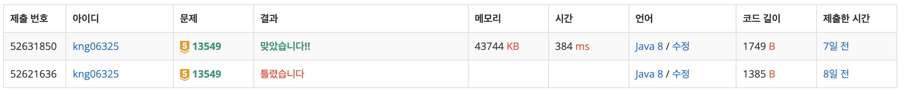

## ❔ 문제

#### [문제 바로가기](https://www.acmicpc.net/problem/13549)

## ❕ 풀이

중요한 문제 조건 : **순간이동을 하는 경우에는 0초 후에 2\*X의 위치로 이동하게 된다.**

처음에 BFS로만 풀어보려고 했다. → 결과 : 틀렸습니다.

이유 : BFS는 **모든 간선의 가중치가 동일해야 한다는** 전제 조건이 필요하다.

그래서 질문 게시판과 유형을 참고해보니 풀이 방식을 3가지 정도로 나눌 수 있다고 한다.

- 다익스트라 알고리즘
- 0-1 BFS: 가중치가 0인 간선에 연결된 정점은 큐의 맨 뒤가 아닌 맨 앞에 넣는 방법
- 2를 별도의 간선으로 생각하지 않고, +1이나 -1에 의한 좌표를 큐에 넣을 때 그 좌표의 2의 거듭제곱 배인 좌표들을 전부 큐에 넣는 방법

이 중 다익스트라 알고리즘(+ 우선순위 큐) 활용해서 풀었다.

나중에 0-1 BFS에 대해서도 공부해보면서 다시 풀면 좋을 것 같다.

### 👀 코드

```java
import java.io.BufferedReader;
import java.io.IOException;
import java.io.InputStreamReader;
import java.util.*;

public class Main_13549_숨바꼭질_3 {
    static int MAX = 100000;
    static class Node {
        int v;
        int cost;

        public Node(int v, int cost) {
            this.v = v;
            this.cost = cost;
        }
    }

    public static void main(String[] args) throws IOException {
        BufferedReader br = new BufferedReader(new InputStreamReader(System.in));
        StringTokenizer st = new StringTokenizer(br.readLine());
        int N = Integer.parseInt(st.nextToken());
        int K = Integer.parseInt(st.nextToken());
        PriorityQueue<Node> pq = new PriorityQueue<>((o1, o2) -> o1.cost - o2.cost);
        int[] dist = new int[MAX + 1];
        boolean[] visited = new boolean[MAX + 1];
        for (int i = 0; i <= MAX; i++) {
            dist[i] = Integer.MAX_VALUE;
        }
        dist[N] = 0;
        visited[N] = true;
        pq.offer(new Node(N, 0));
        while (!pq.isEmpty()) {
            Node cur = pq.poll();
            if(cur.v == K) break;
            if(!visited[cur.v]) visited[cur.v] = true;
            ArrayList<Node> nextNodes = new ArrayList<>();
            if(cur.v - 1 >= 0) nextNodes.add(new Node(cur.v - 1, 1));
            if(cur.v + 1 <= MAX) nextNodes.add(new Node(cur.v + 1, 1));
            if(cur.v * 2 <= MAX) nextNodes.add(new Node(cur.v * 2, 0));

            for(Node next : nextNodes) {
                if(!visited[next.v] && dist[next.v] > cur.cost + next.cost) {
                    dist[next.v] = cur.cost + next.cost;
                    pq.add(new Node(next.v, dist[next.v]));
                }
            }
        }
        System.out.println(dist[K]);

    }
}
```

### 👣 결과

소요 시간 : 1 h


```toc

```
