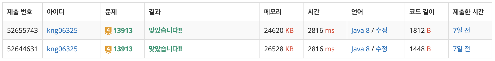

## ❔ 문제

#### [문제 바로가기](https://www.acmicpc.net/problem/13913)

## ❕ 풀이

역추적을 활용하는 BFS 문제

PQ와 visited 배열을 활용해서 최단거리를 찾고 path 배열에 이동 이전의 인덱스를 저장하였다.

그래서 동생 위치에서부터 수빈이까지 도달하는 경로를 거꾸로 출력해주면 풀리는 문제였다.

시간을 더 어떻게 줄여야할지는 모르겠다… (insert가 오래 걸리는 것 같기도 하고?)

### 👀 코드

```java
import java.io.BufferedReader;
import java.io.IOException;
import java.io.InputStreamReader;
import java.util.PriorityQueue;
import java.util.StringTokenizer;

public class Main_13913_숨바꼭질_4 {
    static int MAX = 100000;
    static PriorityQueue<Node> pq;
    static int[] path;
    static boolean[] visited;
    static class Node implements Comparable<Node>{
        int v;
        int cost;
        public Node(int v, int cost){
            this.v = v;
            this.cost = cost;
        }

        @Override
        public int compareTo(Node o) {
            return this.cost - o.cost;
        }
    }
    public static void main(String[] args) throws IOException {

        BufferedReader br = new BufferedReader(new InputStreamReader(System.in));
        StringTokenizer st = new StringTokenizer(br.readLine());
        StringBuilder sb = new StringBuilder();
        int N = Integer.parseInt(st.nextToken());
        int K = Integer.parseInt(st.nextToken());
        visited = new boolean[MAX + 1];
        path = new int[MAX + 1];

        pq = new PriorityQueue<>();
        pq.offer(new Node(N, 0));
        visited[N] = true;
        path[N] = -1;
        Node cur = null;

        while(!pq.isEmpty()){
            cur = pq.poll();
            if(cur.v == K) {
                break;
            }

            move(cur, cur.v - 1);
            move(cur, cur.v + 1);
            move(cur, cur.v * 2);
        }
        System.out.println(cur.cost);
        do {
            sb.insert(0, K + " ");
            K = path[K];
        } while(K != -1);

        System.out.println(sb.toString());

    }

    static void move(Node c, int n) {
        if(n >= 0 && n <= MAX && !visited[n]) {
            visited[n] = true;
            path[n] = c.v;
            pq.offer(new Node(n, c.cost + 1));
        }
    }

}
```

### 👣 결과

소요 시간 : 1 h


```toc

```
