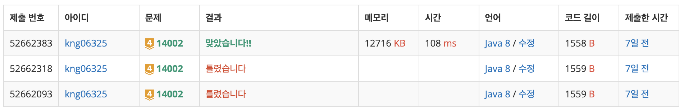

## ❔ 문제

#### [문제 바로가기](https://www.acmicpc.net/problem/14002)

## ❕ 풀이

LIS 문제, DP + 역추적으로 풀었다.

dp 배열은 해당 수를 마지막 원소를 가지는 최장 길이를 저장하고 path 배열은 이전 경로를 저장한다.

answer 변수 초기값 설정에 주의해야한다. (인덱스는 0으로, 길이는 1으로, 왜냐면 감소하는 배열일 수도 있기 때문에!)

### 👀 코드

```java
import java.io.BufferedReader;
import java.io.IOException;
import java.io.InputStreamReader;
import java.util.StringTokenizer;

public class Main_14002_가장_긴_증가하는_부분수열_4 {
    public static void main(String[] args) throws IOException {
        BufferedReader br = new BufferedReader(new InputStreamReader(System.in));
        StringBuilder sb = new StringBuilder();
        int N = Integer.parseInt(br.readLine());
        StringTokenizer st = new StringTokenizer(br.readLine());
        int[] arr = new int[N];
        int[] dp = new int[N];
        int[] path = new int[N];
        for (int i = 0; i < N; i++) {
            arr[i] = Integer.parseInt(st.nextToken());
            dp[i] = 1;
            path[i] = -1;
        }

        int[] answer = new int[]{0, 1};

        for (int i = 1; i < N; i++) {
            for (int j = 0; j < i; j++) {
                if (arr[i] > arr[j] && dp[i] < dp[j] + 1) {
                    dp[i] = dp[j] + 1;
                    path[i] = j;
                }
            }
            if (dp[i] > answer[1]) {
                answer[0] = i;
                answer[1] = dp[i];
            }
        }

        int x = answer[0];
        int size = answer[1];
        int[] result = new int[size];

        for (int i = size - 1; i >= 0; i--) {
            result[i] = arr[x];
            x = path[x];
        }

        sb.append(size).append("\n");
        for (int i = 0; i < size; i++) {
            sb.append(result[i]).append(' ');
        }

        System.out.println(sb.toString());

    }

}
```

### 👣 결과

소요 시간 : 1 h


```toc

```
