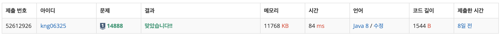

## ❔ 문제

#### [문제 바로가기](https://www.acmicpc.net/problem/14888)

## ❕ 풀이

브루트포스 + 백트래킹

DFS로 모든 경우의 수를 다 해본다.

순열 생각하면서 연산자 개수가 남아있으면 계산하고 재귀 호출했다.

종료 조건은 마지막 피연산자까지 계산했을 때, 그리고 min, max 각각 확인했다.

연산자 개수를 딱 맞게 제공해서 예외 처리(out of bound)가 필요없었다. 굳.

### 👀 코드

```java
import java.io.BufferedReader;
import java.io.IOException;
import java.io.InputStreamReader;
import java.util.LinkedList;
import java.util.Queue;
import java.util.StringTokenizer;

public class Main_3055_탈출 {
    static int R, C;
    static char[][] map;
    static int[][] check;
    static Queue<int[]> queue, water;
    static int[] S, D;
    static int[] dr = {-1, 0, 1, 0};
    static int[] dc = {0, -1, 0, 1};
    public static void main(String[] args) throws IOException {
        BufferedReader br = new BufferedReader(new InputStreamReader(System.in));
        StringTokenizer st = new StringTokenizer(br.readLine());
        R = Integer.parseInt(st.nextToken());
        C = Integer.parseInt(st.nextToken());
        map = new char[R][];
        check = new int[R][C];
        queue = new LinkedList<>();
        water = new LinkedList<>();
        for(int i = 0; i < R; i++){
            String s = br.readLine();
            map[i] = s.toCharArray();
            for(int j = 0; j < C; j++){
                if(map[i][j] == 'S'){
                    S = new int[]{i, j};
                    check[i][j] = 1;
                }
                if(map[i][j] == 'D'){
                    D = new int[]{i, j};
                }
                if(map[i][j] == '*'){
                    water.offer(new int[]{i, j});
                }
            }
        }

        int result = bfs();
        if(result == 0)
            System.out.println("KAKTUS");
        else
            System.out.println(result);

    }

    static int bfs(){
        int[] cur, next;
        int size;
        queue.offer(S);
        while(!queue.isEmpty()){
            // 물 확장
            size = water.size();
            for(int w = 0; w < size; w++){
                cur = water.poll();
                for(int i = 0; i < 4; i++){
                    next = new int[]{cur[0] + dr[i], cur[1] + dc[i]};
                    if (next[0] < 0 || next[0] >= R || next[1] < 0 || next[1] >= C) continue;
                    if (map[next[0]][next[1]] == '.') {
                        water.offer(next);
                        map[next[0]][next[1]] = '*';
                    }
                }
            }

            // 고슴도치 이동
            size = queue.size();
            for(int s = 0; s < size; s++) {
                cur = queue.poll();
                if(map[cur[0]][cur[1]] == 'D'){
                    return check[cur[0]][cur[1]] - 1;
                }
                for (int i = 0; i < 4; i++) {
                    next = new int[]{cur[0] + dr[i], cur[1] + dc[i]};
                    if (next[0] < 0 || next[0] >= R || next[1] < 0 || next[1] >= C) continue;
                    if (check[next[0]][next[1]] > 0 || map[next[0]][next[1]] == '*' || map[next[0]][next[1]] == 'X') continue;

                    queue.offer(next);
                    check[next[0]][next[1]] = check[cur[0]][cur[1]] + 1;
                }
            }
        }
        return 0;
    }
}
```

### 👣 결과



소요 시간 : 30 m

후기 :
풀면 안 어려운데 순열, 조합 이런 거 다시 기억해볼라니까 좀 막막했다.
예외 생기지 않게 연산자 개수 딱 맞게 줬는데 그렇지 않은 가정으로 풀어도 좋을 듯? (연산자가 전부 0개이면 재귀 호출하지 않게 짰음)

```toc

```
