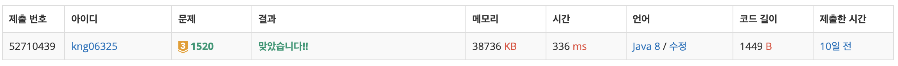

## ❔ 문제

### [문제 바로가기](https://www.acmicpc.net/problem/1520)

#### 유형 : DP DFS

#### 티어 : Gold3

## ❕ 풀이

단순히 BFS, DFS로 풀면 완전탐색에 가깝기 때문에 모두 시간초과가 난다.
따라서 DP를 활용해서 중복으로 경우의 수를 세는 연산을 줄여야 한다.
좌상단에서 우하단까지 경로를 찾을 때마다 해당 경로에 경우의 수를 저장하고 이미 값이 존재한다면 탐색하지 않는 방식이다.
DFS에 DP를 적용하는 부분이 어려웠던 문제였다.

### 👀 코드

```java
import java.io.BufferedReader;
import java.io.IOException;
import java.io.InputStreamReader;
import java.util.StringTokenizer;

public class Main_1520_내리막길 {
    // DFS + DP
    // DFS만 활용하면 시간초과
    // 경로의 경우의 수를 저장하면서 탐색해야한다.

    static int N, M, answer = 0;
    static int[][] map, dp;
    static int[] dr = {-1, 0, 1, 0};
    static int[] dc = {0, -1, 0, 1};

    public static void main(String[] args) throws IOException {
        BufferedReader br = new BufferedReader(new InputStreamReader(System.in));
        StringTokenizer st = new StringTokenizer(br.readLine());
        N = Integer.parseInt(st.nextToken());
        M = Integer.parseInt(st.nextToken());

        map = new int[N][M];
        dp = new int[N][M];
        for (int i = 0; i < N; i++) {
            st = new StringTokenizer(br.readLine());
            for (int j = 0; j < M; j++) {
                map[i][j] = Integer.parseInt(st.nextToken());
                dp[i][j] = -1;
            }
        }
        System.out.println(dfs(0, 0));
    }

    static int dfs(int r, int c) {
        if (r == N - 1 && c == M - 1) { // 최우하단에 도달함 = 경로 하나 생긴 것이므로 dp값을 1로 초기화한 후 리턴
            return dp[r][c] = 1;
        }

        if (dp[r][c] != -1) {    // 이미 값(현재 정점에서 최우하단까지 가는 경로의 수)이 존재한다면
            return dp[r][c];
        }

        dp[r][c] = 0;           // 탐색 시작을 위해서 0으로 초기화
        for (int i = 0; i < 4; i++) {
            int nr = r + dr[i], nc = c + dc[i];
            if (nr < 0 || nr >= N || nc < 0 || nc >= M) continue;    // 범위 체크
            if (map[nr][nc] < map[r][c]) {
                dp[r][c] += dfs(nr, nc);    // 다음 정점의 값을 현재 정점에 더한다.
            }
        }

        return dp[r][c];    // 자신 노드 모두 탐색 완료 후 현재 정점의 값을 리턴해서 부모 노드로 돌아간다.
    }
}
```

### 👣 결과

소요 시간 : 2 h


```toc

```
