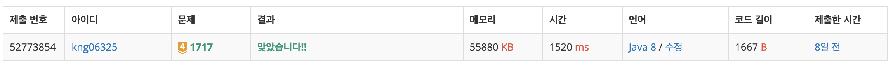

## ❔ 문제

### [문제 바로가기](https://www.acmicpc.net/problem/1717)

#### 유형 : 유니온 파인드 (분리집합)

#### 티어 : Gold4

## ❕ 풀이

유니온 파인드(분리 집합) 활용하는 문제였다.
주어지는 원소를 합집합 연산하거나 같은 집합에 포함되어있는지 확인하는 연산을 수행하는 것이 주어졌다.
유니온파인드의 시간복잡도는 O(1)에 가까운 빠른 알고리즘이다.
나중에 개념 정리를 다시 하면 좋을 것 같지만 간단히 풀이한다.
유니온 파인드를 구현하는 2가지 방식이 있는데 더 효율적인 2번째 방식으로 구현했다.

1. parent 배열을 자기 자신의 원소 값으로 초기화해서 유니온 연산을 하면서 부모 노드의 인덱스를 저장하는 방식
   → 원래 정점이 많았던 집합의 루트가 새로운 집합의 루트가 되는 것이 더 효율적이다. (집합의 크기를 저장해야 한다!)
2. parent 배열을 -1로 초기화해서 유니온 연산을 하면서 루트는 집합의 크기를 음수로, 나머지 노드들은 부모 노드의 인덱스를 저장하는 방식
   → 메모리를 절약하고 효율적이다.

유니온파인드 알고리즘에서 내가 자주 빠뜨리지만, 중요한 포인트는
Find 연산을 하면서 각 정점의 부모를 루트 정점으로 설정하는 것이다. = 그래프 압축
처리하지 않으면 최악의 경우 Find 연산에서 O(N)의 시간복잡도를 가진다.

### 👀 코드

```java
import java.io.BufferedReader;
import java.io.IOException;
import java.io.InputStreamReader;
import java.util.StringTokenizer;

public class Main_1717_집합의_표현 {
    // 유니온 파인드 (분리 집합) : 서로 다른 두 원소가 같은 집합에 속해 있는지 판별하는 알고리즘
    // 시간복잡도 O(a(N))으로 O(1)에 가깝다
    // 방식 1) parent 배열을 자기 자신으로 초기화
    // 방식 2) parent 배열을 -1로 초기화하여 집합의 크기도 파악하도록 한다
    static int N, M;
    static int[] parent;

    public static int findParent(int a) { // 정점 a가 속한 집합의 루트 정점을 반환한다.
        if(parent[a] < 0) { // 루트 정점의 parent 값은 음수인 집합의 크기를 나타낸다.
            return a;
        }
        return parent[a] = findParent(parent[a]); // 각 정점의 부모를 루트 정점으로 설정하여 그래프 압축을 한다. (압축하지 않으면 최악의 경우 시간복잡도 O(N))
    }

    public static void union(int a, int b) { // 정점 a와 b의 집합을 합연산하는 함수, 정점이 더 많은 집합의 루트가 새로운 집합의 루트가 되는 것이 효율적이다.
        int ap = findParent(a);
        int bp = findParent(b);
        if(ap == bp)    // 이미 같은 집합에 있다면
            return;

        if(parent[ap] < parent[bp]) {   // a가 속한 집합의 크기가 더 크다면 해당 집합의 루트 아래에 b가 연결된다. 크기가 음수이기 때문에 < 연산자 활용
            parent[ap] += parent[bp];   // 집합의 크기를 갱신한다.
            parent[bp] = ap;            // bp의 부모를 ap로 설정한다. = ap가 새로운 루트가 된다
        } else {                        // b가 속한 집합의 크기가 더 크다면
            parent[bp] += parent[ap];
            parent[ap] = bp;            // bp가 새로운 루트가 된다.
        }
    }

    public static void main(String[] args) throws IOException {
        BufferedReader br = new BufferedReader(new InputStreamReader(System.in));
        StringTokenizer st = new StringTokenizer(br.readLine());
        N = Integer.parseInt(st.nextToken());
        M = Integer.parseInt(st.nextToken());
        parent = new int[N + 1];
        for (int i = 0; i <= N; i++) {  // parent 배열 초기값을 -1로 설정한다, 집합의 크기를 나타낸다
            parent[i] = -1;
        }
        while (M-- > 0) {
            st = new StringTokenizer(br.readLine());
            int cmd = Integer.parseInt(st.nextToken());
            int a = Integer.parseInt(st.nextToken());
            int b = Integer.parseInt(st.nextToken());
            if (cmd == 0) {     // 유니온
                union(a, b);
            } else {            // 파인드
                if(findParent(a) == findParent(b)) {
                    System.out.println("YES");
                } else {
                    System.out.println("NO");
                }
            }
        }
    }
}

```

### 👣 결과

소요 시간 : 1 h


```toc

```
