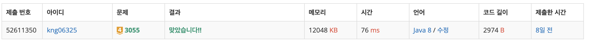

## ❔ 문제

### [문제 바로가기](https://www.acmicpc.net/problem/3055)

#### 유형 : BFS

#### 티어 : Gold3

## ❕ 풀이

심플한 BFS 활용 문제 : 늘 그렇듯 check 배열을 int로 만들어서 이동시간과 중복 확인을 동시에 함

한 단위 시간마다

1. 물 확장 (’고슴도치는 물이 찰 예정인 칸으로 이동할 수 없다’ → **물을 먼저 확장한다**)
   1. 물은 빈 칸으로만 확장 가능
2. 고슴도치 이동
   1. 비버의 소굴이나 빈 칸으로 이동 가능

내가 생각하기에 중요한 포인트는

- 단위 시간마다 queue의 크기만큼만 돌아야한다는 점
- 물도, 고슴도치도!

### 👀 코드

```java
import java.io.BufferedReader;
import java.io.IOException;
import java.io.InputStreamReader;
import java.util.StringTokenizer;

public class Main_14888_연산자_끼워넣기 {
    static int N, min = Integer.MAX_VALUE, max = Integer.MIN_VALUE;
    static int[] arr, op;
    public static void main(String[] args) throws IOException {
        BufferedReader br = new BufferedReader(new InputStreamReader(System.in));
        N = Integer.parseInt(br.readLine());
        arr = new int[N];
        op = new int[4];
        StringTokenizer st = new StringTokenizer(br.readLine());
        for(int i = 0; i < N; i++){
            arr[i] = Integer.parseInt(st.nextToken());
        }
        st = new StringTokenizer(br.readLine());
        for(int i = 0; i < 4; i++){
            op[i] = Integer.parseInt(st.nextToken());
        }

        dfs(0, arr[0]);
        System.out.println(max);
        System.out.println(min);
    }

    static void dfs(int r, int value){
        if(r == N - 1){
            if(value < min) min = value;
            if(value > max) max = value;
        }
        for(int i = 0; i < 4; i++){
            if(op[i] <= 0) continue;
            op[i] -= 1;
            dfs(r + 1, calc(i, value, arr[r + 1]));
            op[i] += 1;
        }
    }

    static int calc(int op, int a, int b){
        switch (op){
            case 0:
                return a + b;
            case 1:
                return a - b;
            case 2:
                return a * b;
            case 3:
                return a / b;
        }
        return 0;
    }
}
```

### 👣 결과

소요 시간 : 30 m


```toc

```
