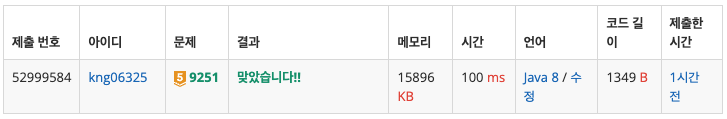

## ❔ 문제

### [문제 바로가기](https://www.acmicpc.net/problem/9251)

#### 유형 : DP 역추적

#### 티어 : Gold5

## ❕ 풀이

[동적 계획법](https://haayun.github.io/dynamic-programming/#9251-lcs) 포스트 작성하면서 푼 문제

- 2차원 테이블을 생성해서 가능한 문자열들의 조합에 대한 공통 부분 수열의 최대 길이를 저장한다.
- 두 문자가 서로 **다른 곳**은 공통 부분 문자열에 속하지 않으므로 **그 전의 길이 최댓값** 그대로 가져옴  
  → 위쪽 or 왼쪽
- 두 문자가 서로 **같은 곳**은 공통 부분 문자열에 추가되므로 **해당 문자들이 포함되기 전의 길이 + 1**  
  → 좌상향 대각선

### 👀 코드

```java
import java.io.BufferedReader;
import java.io.IOException;
import java.io.InputStreamReader;

public class Main_9251_LCS {
    public static void main(String[] args) throws IOException {
        BufferedReader br = new BufferedReader(new InputStreamReader(System.in));
        char[] arr1 = br.readLine().toCharArray();
        char[] arr2 = br.readLine().toCharArray();
        int n1 = arr1.length;
        int n2 = arr2.length;

        // 배열의 크기를 +1 하는 이유: (1, 1)부터 인덱스를 관리하기 위해
        int[][] dp = new int[n1 + 1][n2 + 1];   // LCS의 길이를 저장하는 배열

        for (int i = 1; i <= n1; i++) {
            for (int j = 1; j <= n2; j++) {
                if (arr1[i - 1] == arr2[j - 1]) {       // 두 문자가 같으면 CS에 포함해야 되니까
                    dp[i][j] = dp[i - 1][j - 1] + 1;    // 문자들이 포함되기 전의 길이 + 1
                } else {                        // 두 문자가 다른 경우
                    dp[i][j] = dp[i - 1][j];    // 위쪽의 값을 가져와 저장
                }
                if (dp[i][j] < dp[i][j - 1]) {  // 왼쪽의 값이 더 크다면 갱신
                    dp[i][j] = dp[i][j - 1];
                }
            }
        }

        System.out.println(dp[n1][n2]);   // LCS의 길이를 출력한다.
    }
}

```

### 👣 결과

소요 시간 : 30 m


```toc

```
