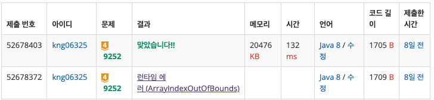

## ❔ 문제

### [문제 바로가기](https://www.acmicpc.net/problem/9252)

#### 유형 : DP 역추적

#### 티어 : Gold4

## ❕ 풀이

[9251 LCS](https://haayun.github.io/boj-9251) 문제와 동일하게 공통 부분 수열의 최대 길이를 출력하고 그 문자열까지 출력하는 문제이다.
즉, 경로를 역추적해서 답을 찾는다.  
→ 경로를 저장하는 2차원 배열이 추가로 필요하다. 어느 방향에서 왔는지 저장한다. (0: 위에서, 1: 왼쪽에서, 2: 좌상향에서)

### 👀 코드

```java
import java.io.BufferedReader;
import java.io.IOException;
import java.io.InputStreamReader;

public class Main_9252_LCS_2 {
    public static void main(String[] args) throws IOException {
        BufferedReader br = new BufferedReader(new InputStreamReader(System.in));
        char[] arr1 = br.readLine().toCharArray();
        char[] arr2 = br.readLine().toCharArray();
        int n1 = arr1.length;
        int n2 = arr2.length;

        // 배열의 크기를 +1 하는 이유: (1, 1)부터 인덱스를 관리하기 위해
        int[][] dp = new int[n1 + 1][n2 + 1];   // LCS의 길이를 저장하는 배열
        int[][] path = new int[n1 + 1][n2 + 1]; // 어느 경로를 택했는지 저장하는 배열 (0: 위에서, 1: 왼쪽에서, 2: 좌상향에서)
        for (int i = 0; i <= n1; i++) {
            for (int j = 0; j <= n2; j++) {
                path[i][j] = -1;
            }
        }
        for (int i = 1; i <= n1; i++) {
            for (int j = 1; j <= n2; j++) {
                if (arr1[i - 1] == arr2[j - 1]) {       // 두 문자가 같으면 CS에 포함해야 되니까
                    dp[i][j] = dp[i - 1][j - 1] + 1;    // 문자들이 포함되기 전의 길이 + 1
                    path[i][j] = 2;
                } else {                        // 두 문자가 다른 경우
                    dp[i][j] = dp[i - 1][j];    // 위쪽의 값을 가져와 저장
                    path[i][j] = 0;
                }
                if (dp[i][j] < dp[i][j - 1]) {  // 왼쪽의 값이 더 크다면 갱신
                    dp[i][j] = dp[i][j - 1];
                    path[i][j] = 1;
                }
            }
        }

        // 역추적하기
        StringBuilder sb = new StringBuilder();
        int[] dr = {-1, 0, -1};         // 위쪽, 왼쪽, 좌상향
        int[] dc = {0, -1, -1};
        int r = n1, c = n2;             // 최우하단에서 출발 (완성된 경로)
        System.out.println(dp[r][c]);   // LCS의 길이를 출력한다.

        while (path[r][c] != -1) {      // 좌상단 경계를 만날 때까지
            int d = path[r][c];
            if (d == 2) {               // LCS에 포함되는 단어인 경우
                sb.append(arr1[r - 1]);
            }
            r += dr[d];
            c += dc[d];
        }
        System.out.println(sb.reverse());   // 간편하게 역방향으로 출력할 수 있다.
    }
}

```

### 👣 결과

소요 시간 : 1 h


```toc

```
