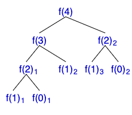
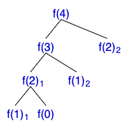

# 동적 계획법이란?

## 동적 계획법

- 특정 범위까지의 값을 구하기 위해 **이전 범위의 값을 활용**하여 효율적으로 값을 얻는 기법
- 이전 범위의 값을 저장(Memoization)함으로써 **시간적, 공간적 효율** 얻음

<br>

## 피보나치 수

### [10870 피보나치 수 5](https://www.acmicpc.net/problem/10870)

### 문제

- F(n) = F(n - 1) + F(n - 2) (n >= 2)
- n번째 피보나치 수를 구하는 문제

### 제한사항

- 0 <= n <= 20

### 재귀함수로 풀 수 있다!

```java
int fibonacci(int n) {
  if(n <= 1) return n;
  return fibonacci(n - 1) + fibonacci(n - 2);
}
```

### [15624 피보나치 수 7](https://www.acmicpc.net/problem/15624)

### 문제

- F(n) = F(n - 1) + F(n - 2) (n >= 2)
- n번째 피보나치 수를 구하는 문제

### 제한사항

- 0 <= n <= 1,000,000

### 재귀함수로?

- **절대 불가능하다!**
- n의 범위가 커서 **시간초과**가 난다

<br>

### n = 4



**함수 호출 수**  
f(4) : 1  
f(3) : 1  
f(2) : 2  
f(1) : 3  
f(0) : 2

→ **같은 함수를 여러 번 호출**하는 경우가 많다!

<br>

### n = 20이라면?

**함수 호출 수**  
f(0) : 4181  
f(1) : 6765  
f(2) : 4181  
.  
.  
.

→ N이 커지면 함수 호출이 훨씬 많이 발생한다!

→ **이미 구한 답을 또 계산할 필요가 있을까?**

<br>

## 동적 계획법 활용하기

### Memoization

- **이전에 구해둔 값을 저장**해서 중복 계산을 방지
- **이전 범위의 답**을 구하면, 바로 **배열에 저장**하자!
- **시간과 공간**면에서 모두 효율적!

### 피보나치 수 문제에 적용하기

### n = 4



**DP**

| 0   | 1   | 2   | 3   | 4   |
| --- | --- | --- | --- | --- |
| 0   | 1   | 1   | 2   | 3   |

```java
int fibonacci(int n) {
  if(n <= 1) return n;
  if(dp[n] != 0) return dp[n];
  return dp[n] = f(n - 1) + f(n - 2);
}
```

- **Top-down** 방식 (n부터)
- 구하려 하는 문제를 **작은 문제로 호출**하며 탐색
- 재귀함수를 활용

### 다르게 구현하기

```java
dp[1] = 1;
for(int i = 2; i <= n; i++) {
  dp[i] = dp[i - 1] + dp[i - 2];
}
```

- **Bottom-up** 방식 (0부터)
- **이미 알고 있는 작은 문제부터** 원하는 문제까지 탐색
- Top-down 방식보다 **속도가 빠르다!**

<br>

## 동적 계획법을 적용하는 상황

- 주어진 문제를 부분 문제로 나누었을 때, **부분 문제의 답을 통해 주어진 문제의 답을 도출**할 수 있을 때
- **부분 문제의 답을 여러 번** 구해야 할 때
- 즉, 한 번 계산한 값을 **다시 사용**해야 할 때

## 동적 계획법으로 문제 푸는 방식

### 점화식

- 인접한 항들 사이의 **관계식**
- 동적 계획법 문제를 풀 때는, 점화식을 미리 세우고 풀면 좋다!
- 이전 값들을 통해 현재의 **DP를 정의**하자!

<br>

## 문제에 적용하기!

### [1932 정수 삼각형](https://www.acmicpc.net/problem/1932)

### 문제

- 정수 삼각형이 주어졌을 때, 맨 위층부터 아래층으로 내려오면서 이제까지 선택된 수의 합이 **최대가 되는 경로**를 구해라
- 현재 층에서 **대각선 왼쪽** 또는 **대각선 오른쪽**으로만 이동 가능

### 제한사항

- 삼각형 크기 <= 500
- 삼각형을 이루는 정수 0 ~ 9,999

### 예제

5  
7  
3 8  
8 1 0  
2 7 4 4  
4 5 2 6 5

- **Bottom-up** 방식의 DP (이미 아는 작은 문제부터 탐색)
- 현재 위치에서 왼쪽 위 대각선, 오른쪽 위 대각선 중 어느 경로를 택해야 최대 경로인지 구하자!
- 현재 인덱스 : (i, j)
- 왼쪽 위 대각선 : (i - 1, j - 1)
- 오른쪽 위 대각선 : (i - 1, j)

→ (1, 1) 인덱스부터 현재 인덱스에서 최대 경로값을 배열에 저장하며 풀자!

```java
dp[1][1] = triangle[1][1];
for(int i = 2; i <= n; i++) {
  for(int j = 1; j <= i; j++) {
    dp[i][j] = Math.max(dp[i - 1][j - 1], dp[i - 1][j]) + triangle[i][j];
  }
}
```

#### Top-down 방식으로 풀면

```java
int topDown(int row, int col) {
  if(row == 1) return triangle[1][1];
  if(row == 0 || col == 0) return 0;
  if(dp[row][col] >= 0) return dp[row][col];  // 이미 값을 구한 경우
  return dp[row][col] = Math.max(topDown(row - 1, col - 1), topDown(row - 1, col)) + triangle[row][col];
}
```

<br>

### [2579 계단 오르기](https://www.acmicpc.net/problem/2579)

### 문제

- 계단은 한 번에 1칸 or 2칸 오를 수 있다.
- 연속된 세 개의 계단을 모두 밟으면 안된다. (시작점은 포함 x)
- 마지막 도착 계단은 반드시 밝는다.
- 각 칸의 점수가 주어질 때, **얻을 수 있는 점수의 최댓값** 구하는 문제

### 제한사항

- 계단 개수 <= 500
- 점수 <= 10,000

→ **각 계단마다의 최댓값**을 구한 후 저장하며 풀면 되지 않을까?

### 접근

- DP에 현재 계단까지의 점수의 최댓값 저장
- 현재 계단은 1칸 or 2칸 전 계단에서 온 것  
  → dp[i] = MAX(dp[i - 1], dp[i - 2]) + score[i]  
  → 이것만으로는 **연속 세 칸**을 잡아낼 수 없다!

- 한 칸 전에서 온 값을 쓰고 싶다면, 3칸 전에서 2칸 이동 후 한 칸 전으로 온 경우를 생각한다  
  → dp[i] = MAX(dp[i - 2], dp[i - 3] + score[i- 1]) + score[i]

<br>

## 점화식 세우는 연습하기

### [11053 가장 긴 증가하는 부분 수열](https://www.acmicpc.net/problem/11053)

### 문제

- 수열 A가 주어졌을 때, 가장 긴 증가하는 부분 수열의 길이를 구하는 문제

### 제한사항

- 수열 A의 길이 범위는 1 <= len(A) <= 1,000

### 가장 긴 증가하는 부분 수열 (LIS)

[**10**, **20**, 10, **30**, 20, **50**]

### 접근

- 모든 부분 수열을 구해서 증가하는 부분 수열인지 검사하는 **브루트포스 접근**  
  → 시간 복잡도 O(2^n), n은 최대 1,000이므로 **절대 불가능!**

- 수열을 **0번 인덱스부터 탐색**하며 **해당 인덱스로 끝나는 부분 수열의 최댓값을 계산**해나가면 어떨까?

**DP**

| 0    | 1   | 2   | 3   | 4   | 5   |
| ---- | --- | --- | --- | --- | --- |
| 1    | 2   | 1   | 3   | 2   | 4   |
| [10, | 20, | 10, | 30, | 20, | 50] |

- 현재 수의 값보다 작은 전의 값들 중, 길이가 가장 긴 것(dp값이 가장 큰 것)을 고르는 것이 핵심이다.
- dp[i] = MAX(Σ dp[j]) + 1 (단, A[j] < A[i], j는 0부터 i-1까지)

<br>

## 응용 문제 - knapsack

### [12865 평범한 배낭](https://www.acmicpc.net/problem/12865)

### 문제

- **최대 무게(k)**가 정해진 배낭에 물건을 넣는다.
- 각 물건은 **무게(w)와 가치(v)**가 있다.
- 배낭에 넣을 수 있는 물건들의 **가치합의 최댓값**을 구하는 문제

### 제한사항

- 물건의 수 N (1 <= N <= 100)
- 배낭의 무게 K (1 <= K <= 100,000)
- 물건의 무게 W (1 <= W <= 100,000)
- 물건의 가치 V (0 <= V <= 1,000)

### 접근

- 물건의 가능한 조합을 모두 구한 후, 무게가 K 이내이면서 가치합이 최대인 경우를 찾는 **브루트포스 접근**
  → 시간복잡도 O(2^n), 물품의 수가 최대 100이므로 절대 불가능!

- 물건의 가능한 조합을 구하는데, 중간에 무게가 K를 초과하는 경우를 모두 쳐내며 가치합이 최대인 경우를 찾는 **백트래킹 접근**  
  → 왠지 가능해 보이지만, 이 풀이도 최악의 경우 K를 초과하는 경우가 없으면 결국 브루트포스와 동일, 불가능!

- 동적 계획법을 활용하기  
  → **K 이전의 무게들에 대한 정답**(가치합의 최대값)을 저장하며 풀면 어떨까?
  → **무게를 인덱스**로 설정한다!

- K까지의 무게를 인덱스로 나타내고 현재 물품을 배낭에 넣는 경우 or 안 넣는 경우 중 최댓값을 저장하자
- 배낭에 넣는 경우?  
  → 현재 물품 무게만큼 배낭에 추가되기 때문에 **[현재 배낭 무게 - 물품 무게]**인 배낭 무게에서의 최대 가치값 + 현재 물품 가치값
- 배낭에 안 넣는 경우?  
  → **현재 배낭 무게에 저장된 정답**을 그대로 사용한다

### 예제

4 7  
6 13  
4 8  
3 6  
5 12

|       | 0   | 1   | 2   | 3   | 4   | 5   | 6   | 7   |
| ----- | --- | --- | --- | --- | --- | --- | --- | --- |
| dp[1] | 0   | 0   | 0   | 0   | 0   | 0   | 13  | 13  |
| dp[2] | 0   | 0   | 0   | 0   | 8   | 8   | 13  | 13  |
| dp[3] | 0   | 0   | 0   | 6   | 8   | 8   | 13  | 14  |
| dp[4] | 0   | 0   | 0   | 6   | 8   | 12  | 13  | 14  |

### 점화식

- dp[i][j] = MAX(dp[i - 1]j - product[i].w] + product[i].v, dp[i - 1][j]), (단, product[i].w <= j)

- 2차원 DP : 그 전 물품까지의 정보만 사용해야 하기 때문에
- 해당 물품을 또 사용하는 경우를 방지하기 위해 물품을 행으로 구분해서 중복 방지

→ 사실 1차원 DP로 가능하다

- 무게를 감소하며 계산하면 뒤에서부터 채워지므로 중복 사용이 방지된다

<br>

### [9251 LCS](https://www.acmicpc.net/problem/9251)

### 문제

- LCS(최장 공통 부분 수열) : 두 수열의 공통 부분 수열 중 가장 긴 것
- 두 문자열의 LCS의 길이를 구하는 문제0

### 제한사항

- 수열 최대 1000글자

### 예제

**ACA**Y**K**P  
C**A**P**CAK**

### 접근

ACAYKP  
**C**APCAK

- C에 대한 A, AC, ACA, ACAY, ACAYK, ACAYKP의 LCS를 저장  
  → 가능한 이전 문자열들의 조합에 대한 공통 부분 수열의 최대 길이를 저장하며 풀자

|     | A   | C   | A   | Y   | K   | P     |
| --- | --- | --- | --- | --- | --- | ----- |
| C   | 0   | 1   | 1   | 1   | 1   | 1     |
| A   | 1   | 1   | 2   | 2   | 2   | 2     |
| P   | 1   | 1   | 2   | 2   | 2   | 3     |
| C   | 1   | 2   | 2   | 2   | 2   | 3     |
| A   | 1   | 2   | 3   | 3   | 3   | 3     |
| K   | 1   | 2   | 3   | 3   | 4   | **4** |

- 두 문자가 서로 **다른 곳**은 공통 부분 문자열에 속하지 않으므로 **그 전의 길이 최댓값** 그대로 가져옴  
  → 위쪽 or 왼쪽

- 두 문자가 서로 **같은 곳**은 공통 부분 문자열에 추가되므로 **해당 문자들이 포함되기 전의 길이 + 1**  
  → 좌상향 대각선

## 정리

- 이전의 답을 저장하고, 계속 사용하며 현재 답을 구하는 동적 계획법
- 입력 범위가 나름 크다, 더 크다면 **그리디** 고려한다.
- 마지막 인덱스에서 내려가는 **Top-down**, 처음 인덱스부터 올라가는 **Bottom-up** 방식이 존재한다.
- 문제에 따라 **1차원** 또는 **2차원 테이블**을 사용한다.
- **점화식**을 잘 세우면 구현은 어렵지 않다.
- **LIS, 냅색, LCS**는 동적 계획법으로 푸는 대표적인 문제 & 방식
- 세 유형의 풀이는 다른 동적 계획법 문제에서 많이 응용된다.

## 후기

LIS, LCS 문제들을 풀려고 했는데 다시 DP를 공부해야했다고 생각했다... 알튜비튜의 자료는 언제 봐도 도움이 되기 때문에 직접 문제들을 다시 풀고 하나하나 뜯어보면서 작성했다. 한 때 DP가 너무 어려워서 DP 문제만 푼 적도 있는데 여전히 어렵다..ㅋㅋㅋ 연습만이 살 길이다...

## 출처

[Altu-Bitu](https://github.com/Altu-Bitu/Notice) : 튜티로 활동한 알고리즘 튜터링 프로그램의 자료를 정리했습니다.
